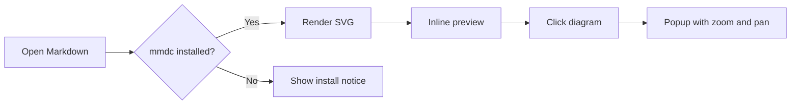
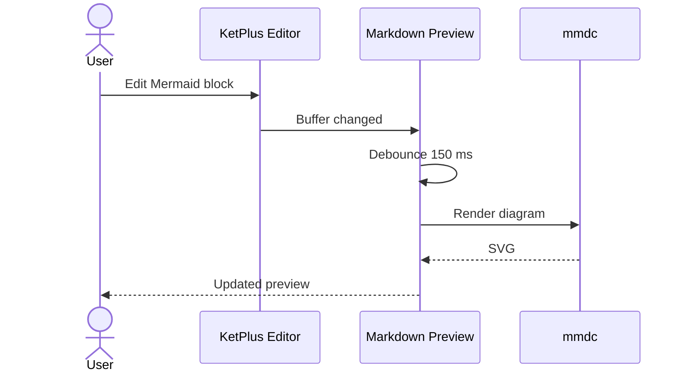
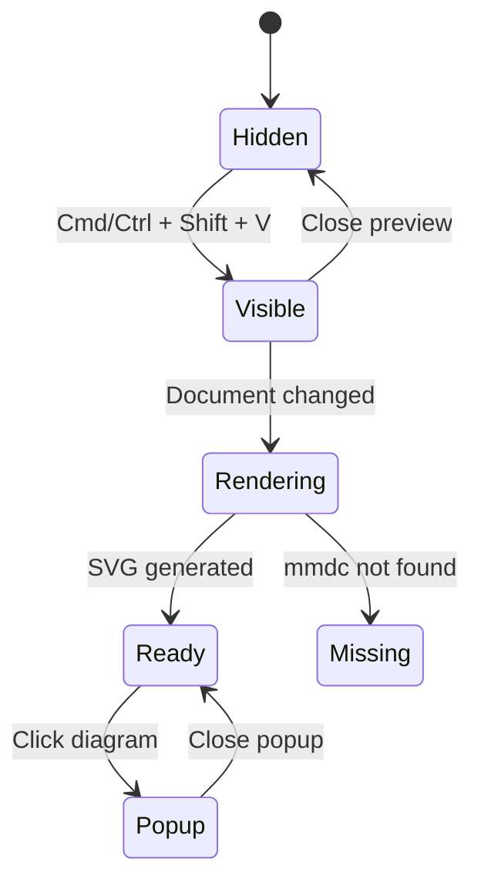

# KetPlus Markdown Preview

File này dùng để kiểm tra Markdown preview, Mermaid và theme của KetPlus.

> Mở file rồi nhấn **Cmd/Ctrl + Shift + V** để bật preview.
> Click vào một sơ đồ Mermaid để mở popup; cuộn để zoom và kéo để pan.

## Nội dung cơ bản

KetPlus hỗ trợ **bold**, *italic*, ~~strikethrough~~, `inline code` và
[liên kết tới phần Mermaid](#mermaid).

### Checklist

- [x] Markdown preview từ buffer chưa lưu
- [x] Theme sáng và tối
- [x] Ảnh và link tương đối
- [x] Mermaid qua `mmdc`
- [ ] Scroll sync theo dòng

### Bảng

| Thành phần | Trạng thái | Ghi chú |
|---|:---:|---|
| Markdown | ✅ | Render native bằng Qt |
| Mermaid | ✅ | Render SVG bằng `mmdc` |
| Zoom/Pan | ✅ | Mở bằng popup riêng |

### Ảnh tương đối


## Code

```cpp
#include <iostream>

int main() {
    std::cout << "Hello from KetPlus!\n";
    return 0;
}
```

```json
{
  "editor": "KetPlus",
  "preview": true,
  "languages": ["Markdown", "Mermaid"]
}
```

## Mermaid

### Flowchart



### Sequence diagram



### State diagram



---

If Mermaid does not render, install the official CLI:

```sh
npm install -g @mermaid-js/mermaid-cli
```
